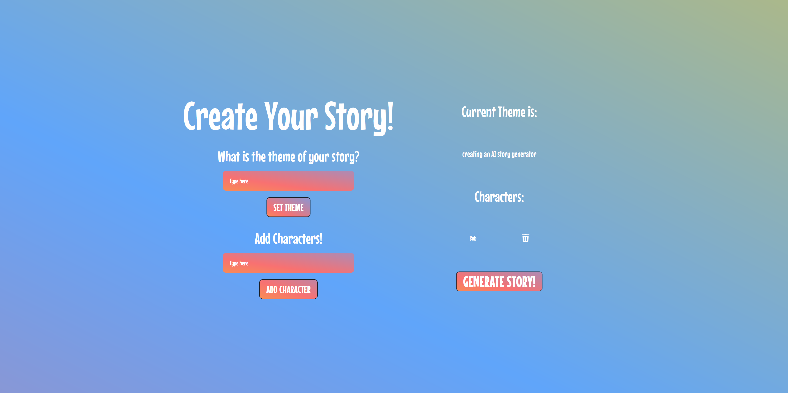
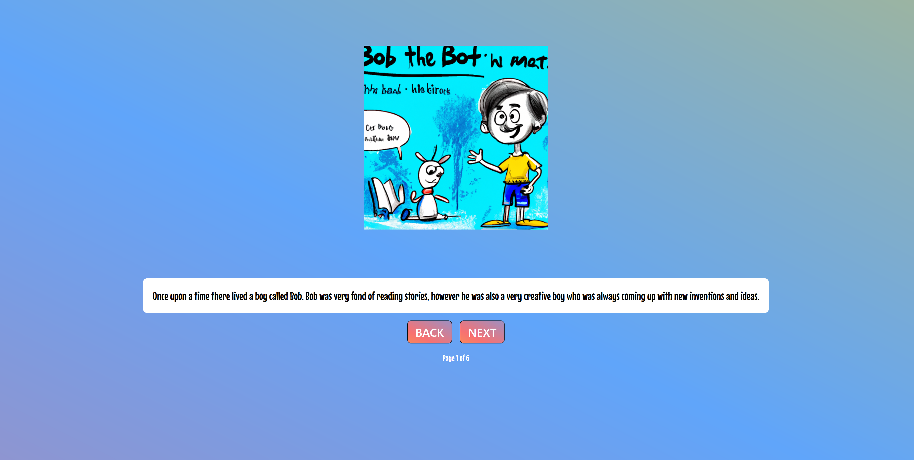
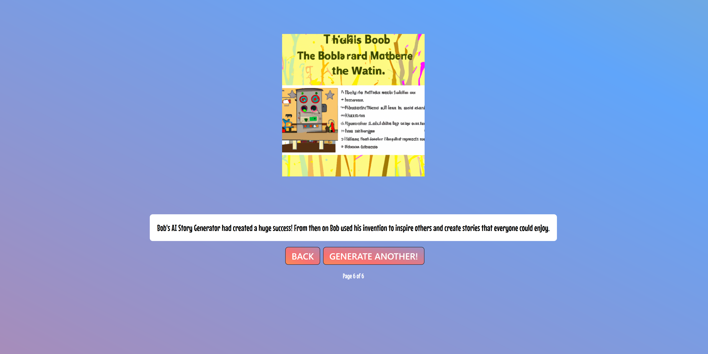

# Stor-AI-Teller

StorAI Teller is innovative webapp that allows kids and parents to create completely unique stories using AI. 
Its no question that kids should be reading more, it helps expand vocabulary, improves writing, builds independence and self confidence, and fuels imagination
Not everyone has access to books: books can be expensive, and libraries are not always commonplace or well stocked. Online, books may be more accessible, but can also be behind a paywall.


StoryAI Teller solves this problem by potentially creating an infinite well of unique stories at a click of a button. Currently free, though likely AI pictures/text completion will always be dirt cheap compared to hiring professionals. 

There are additional benefits to StorAI Teller as well, it can stimulates children’s creativity, aiding them in gaining inspiration and understanding of how stories are created and structured. Additionally, activities can be structured around StorAI Teller: Don’t like the pictures that are generated? A cool activity would be to draw your own, using the AI generated photos as a launching point.

Try it Today! (Currently in Alpha)

## Demo/Explaination Video

[](http://www.youtube.com/watch?v=hzhaBG5DpFo)

## Try It Yourself

#### To Launch Frontend Webapp

1. Install Packages
```
cd frontend
npm install
```
2. Launch Webapp

```
cd frontend
npm run dev
```
#### To Launch Backend Server:

* Commands will be different on different operating systems, google is your friend

1. Start Python Virtual Environment and Install Packages
```
cd backend
python venv
venv/Scripts/activate
python -m pip install flask
python -m pip install openai
``` 
2. Set OpenAI API Key
```
create a file called constants.py
(in constants.py) OAI_KEY = [Your Key, keep this secret]
```
3. Start Server
``` 
cd backend
venv/Scripts/activate
python server.py
``` 

### Gallery




